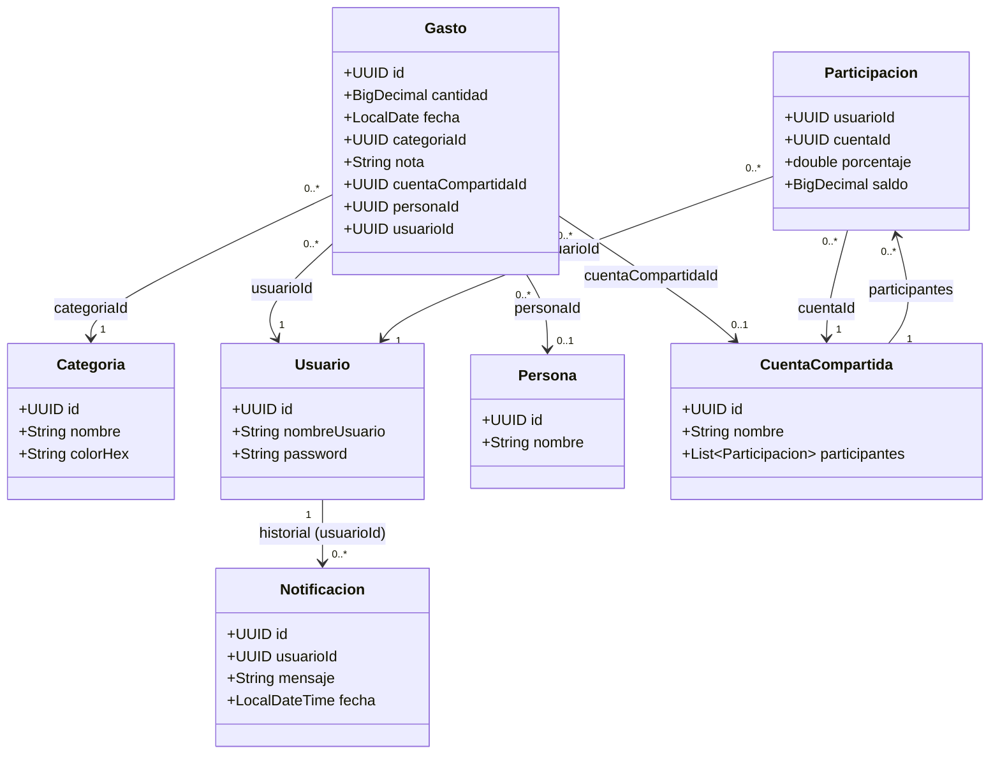

# 1. Modelo de dominio (diagrama de clases)

Este documento recoge el **modelo de dominio principal** del proyecto.

> **Nota de persistencia:** en la implementación, varias asociaciones se guardan por **identificador (UUID)** (por ejemplo, `Gasto.categoriaId`) para simplificar la serialización en JSON. La relación se resuelve en servicios/repositorios.

## Reglas y observaciones relevantes

- **IDs y referencias:** las entidades usan `UUID` como identificador y las asociaciones se expresan mediante IDs (`categoriaId`, `cuentaCompartidaId`, etc.) para persistir en JSON.
- **Cuenta compartida:**
  - La cuenta agrupa participantes (`Participacion`) y mantiene un **saldo** por participante.
  - Cada `Participacion` tiene un **porcentaje** (0–100). En modo equitativo, el porcentaje se reparte por igual.
  - Restricción de negocio del enunciado: **una vez creada** la cuenta con la lista de participantes, **no se modifica** dicha lista.
- **Gasto:**
  - Un gasto siempre pertenece a un `Usuario`.
  - Opcionalmente puede asociarse a una `CuentaCompartida` y/o a una `Persona` (pagador en la cuenta).
- **Notificaciones:** se almacenan como historial ligado al `Usuario`.

