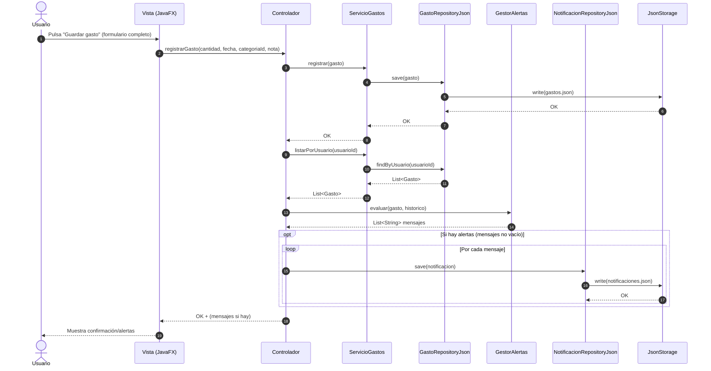

# 3. Diagrama de interacción (secuencia)

Se muestra el flujo de la historia **HU-02 — Registrar gasto personal**, incluyendo:
- Persistencia del gasto
- Evaluación de alertas
- Persistencia de notificaciones (historial)

Por claridad, se omiten en el diagrama los flujos alternativos de validación y errores de persistencia, que se gestionan mediante mensajes de error en la interfaz.
