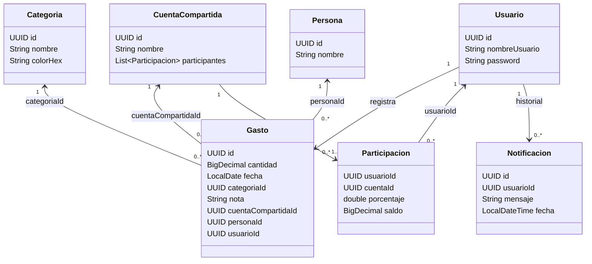

# 1. Diagrama de clases del dominio

Este documento recoge el **modelo de dominio** principal del proyecto.

> Nota: en la implementación, varias asociaciones se persisten **por identificador (UUID)** (por ejemplo, `Gasto.categoriaId`), para simplificar la serialización JSON.

## Reglas y observaciones relevantes

- **Gasto**: representa un registro económico con **cantidad**, **fecha**, **categoría** y una nota opcional. Puede ser **personal** (sin cuenta compartida) o estar vinculado a una **CuentaCompartida**.
- **CuentaCompartida**: agrupa a varios usuarios participantes (vía `Participacion`) y mantiene el reparto por **porcentaje**.
- **Participacion**: guarda el **porcentaje** del reparto y el **saldo** acumulado (positivo si el grupo le debe, negativo si debe al grupo). El saldo se actualiza al registrar un gasto compartido.
- **Notificacion**: representa los avisos generados por el sistema de alertas y se persiste como historial del usuario.
- **Persona**: entidad disponible para representar a pagadores dentro de una cuenta (en el estado actual del proyecto, la UI/flujo principal se apoya en `Usuario`).
